# API

The language has two basic types, which are numbers and text. Similarly, the language is also divided into these two types, meaning text does not work with numbers.

## Code blocks

Code blocks are used to execute necessary commands, such as an `IF` or a `GOTO` statement.

We use `:` to define the beginning of a block, followed by its name, and then we end the block with `END`. Inside the block, we write what we want to be executed when called.

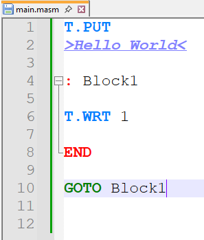

The `GOTO` command is used to call a code block.

## Number

### 1. Add a number to memory

The memory is divided into 3 files, which can only be accessed by the main directory of the compiler. This was done to facilitate the analysis of the code and its results.

These files are:
 
<code>cache.rom</code>
<code>text_cache.rom</code>
<code>block_cache.rom</code>

1. To add numbers to memory, we use this code:

   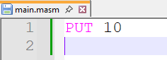

   Numbers are stored in memory addresses, and they are allocated according to the order in which they are placed in the files.

   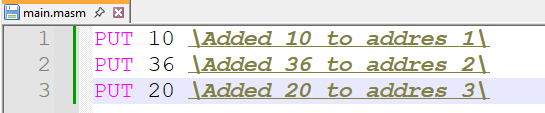

### 2. Show a number in the console

1. To show a number in the console, you need to add it to memory first. Then, retrieve it from memory and display it using the `WRT` command.

   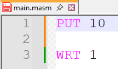
   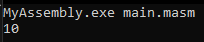

   We can handle multiple numbers in memory and display them in the order we want.

   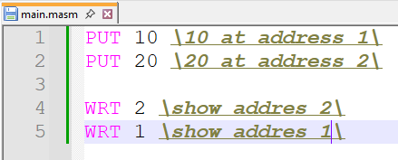
   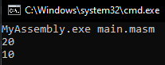

### 3. Handle user inputs

1. To handle user inputs, we use the `INP` command. It is placed in the same way as the `PUT` command, meaning its address depends on the position it was placed in the code.

   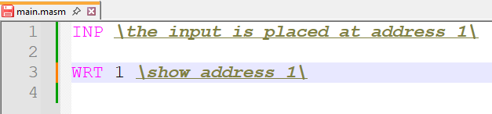
   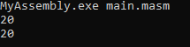

### 4. Conditions

1. Before checking a condition, we first need to define code blocks. These code blocks will be the actions that will be performed if the condition is true or false.

   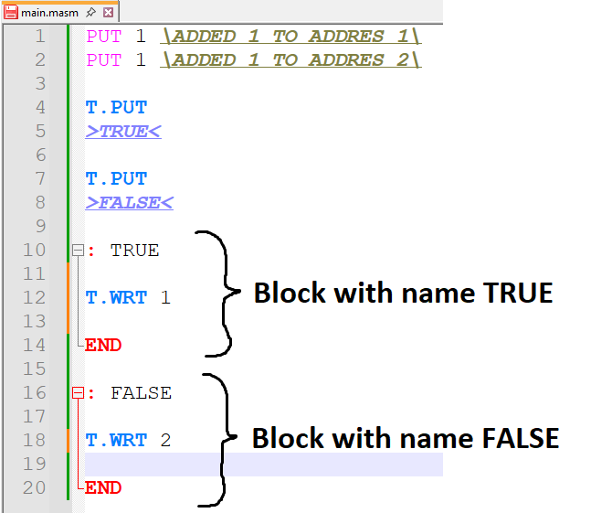

   Unlike most languages, the `IF` statement has a more distinct syntax.

   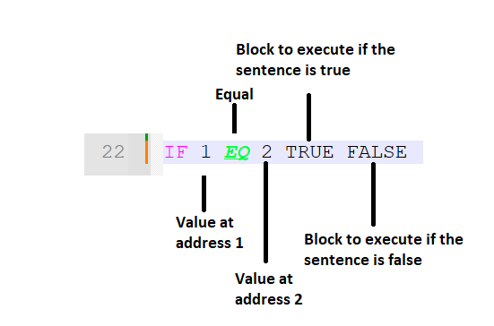

   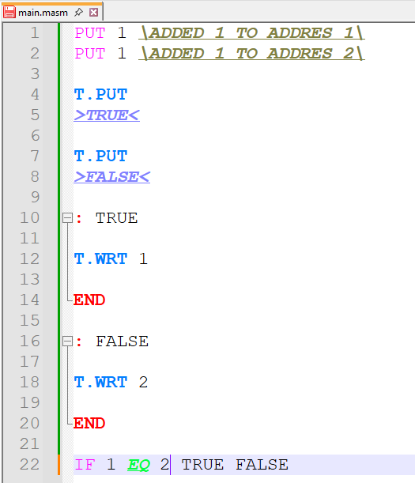

   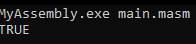

## Text

### 1. Add text to memory

1. To add a text to memory we use the code `T.PUT`

   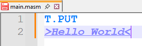

   You need to place the text between `><` on the line below the `T.PUT`

### 2. Show text in the console

1. To show text in the console, you need to add it to memory first. Then, retrieve it from memory and display it using the `T.WRT` command.

   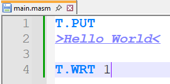
   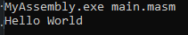

   We can handle multiple texts in memory and display them in the order we want.

   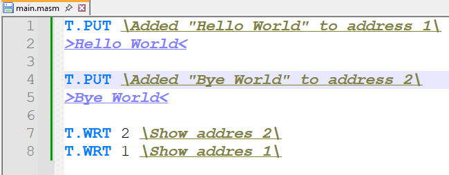
   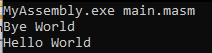

### 3. Handle user inputs

1. To handle user inputs, we use the `T.INP` command. It is placed in the same way as the `T.PUT` command, meaning its address depends on the position it was placed in the code.

   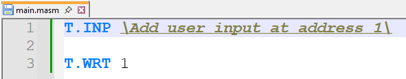
   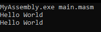

### 4. Conditions

### 4. Conditions

1. Conditions work the same way as number conditions.

   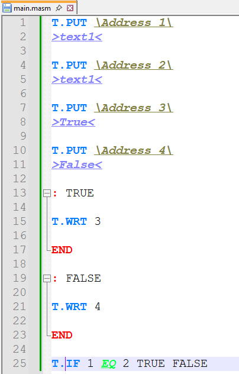

   The only difference is using `T.IF` instead of `IF`.

   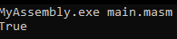

## Other statement

<code>{SEP}</code> : Add a separator in output

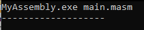

<code>{CLS}</code> : Clear the output

<code>GOTO</code> : Go to the block code named

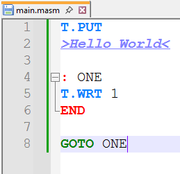

<code>REP</code> : Repeat the block code n of times

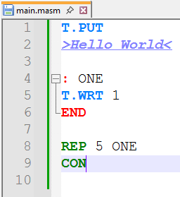
